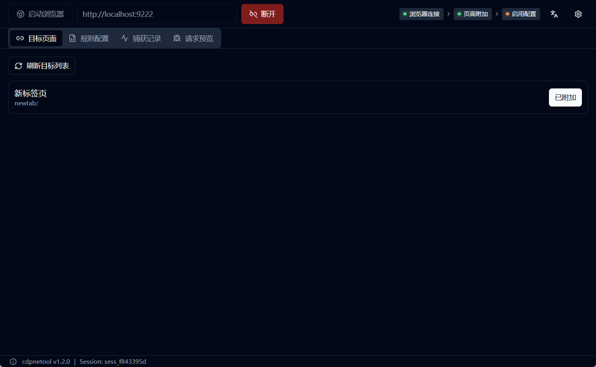
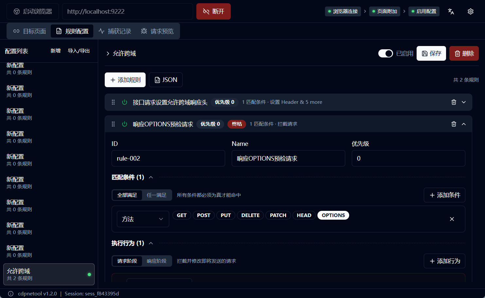
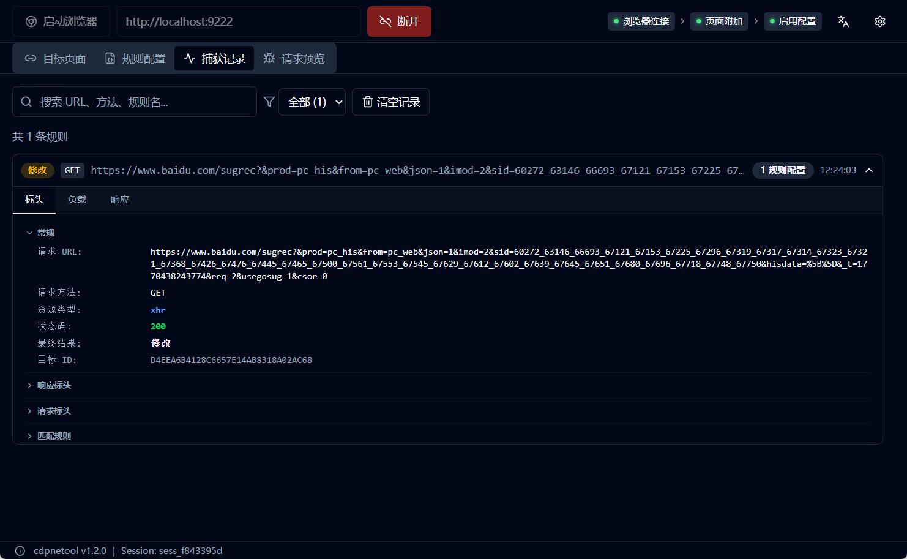
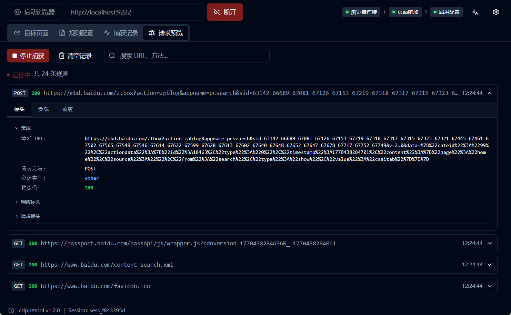

# 项目介绍

## 什么是 cdpnetool

**cdpnetool** 是一款基于 Chrome DevTools Protocol 的网络请求拦截与修改工具。它允许用户通过规则配置实时拦截和修改浏览器网络请求，无需编写任何代码。

作为一款跨平台桌面应用程序，cdpnetool 提供了直观的可视化界面，让开发者、测试人员甚至普通用户都能轻松实现网络请求的精准控制和灵活修改。

---

## 核心功能特性

- ✅ **实时网络拦截**  
  拦截浏览器的所有 HTTP/HTTPS 请求和响应，支持所有资源类型（XHR、Fetch、Document、Script、Image 等）

- ✅ **灵活规则配置**  
  提供可视化规则编辑器和 JSON 源码编辑双模式，满足不同用户的使用习惯

- ✅ **丰富的匹配条件**  
  支持 URL、Header、Query 参数、Cookie、Body 等多维度匹配，支持精确匹配、包含匹配、正则表达式等多种匹配方式

- ✅ **强大的修改能力**  
  可修改请求 URL、请求方法、请求头、请求体、响应状态码、响应头、响应体等几乎所有网络请求的属性

- ✅ **配置管理**  
  支持多配置保存、快速切换、导入导出，方便团队协作和配置共享

- ✅ **事件监控**  
  实时查看匹配和未匹配的请求事件，提供 DevTools 风格的详情面板，便于调试和分析

- ✅ **请求预览**  
  全量流量监控，可查看所有网络请求（不仅限于匹配的请求），支持开启/关闭捕获

- ✅ **系统设置**  
  支持语言切换（简体中文/英文）、主题模式（浅色/深色/跟随系统）、浏览器自定义配置

- ✅ **内置浏览器**  
  一键启动独立的 Chrome 实例，无需手动配置启动参数

---

## 适用场景

### 前端开发场景

- **Mock API 数据**：无需等待后端接口开发完成，直接模拟接口响应进行前端开发
- **测试不同数据状态**：修改接口响应数据，快速测试各种边界情况和异常状态下的 UI 表现
- **调试跨域问题**：修改响应头绕过 CORS 限制，便于本地开发调试
- **资源替换调试**：替换线上的 JS/CSS 文件为本地版本，实现不重新部署的调试

### 软件测试场景

- **边界测试**：修改请求参数测试边界情况和异常输入的处理逻辑
- **错误模拟**：模拟各种错误响应（500、404、超时等），验证系统容错能力
- **安全测试**：注入特殊字符和恶意数据，测试防注入和安全防护能力
- **性能分析**：阻止特定资源加载，分析其对页面性能的影响

### 逆向分析场景

- **协议分析**：拦截和分析加密请求，研究 API 协议和通信机制
- **行为探测**：修改请求参数，探测服务端的处理逻辑和业务规则
- **限制绕过**：绕过客户端的校验和限制，深入分析应用行为

### 普通用户场景（通过共享配置）

- **个性化定制**：替换网站的样式文件、字体、图片等资源，实现个性化浏览体验
- **广告屏蔽**：阻止特定的广告请求，净化浏览环境，提升浏览体验
- **网络加速**：阻止追踪脚本、统计代码和不必要的资源，减少页面加载时间
- **功能增强**：修改 API 响应实现功能扩展，例如解除复制限制、下载限制、右键限制等
- **本地化修改**：替换接口数据实现界面汉化或内容定制，提升使用体验
- **移动端调试**：结合远程调试功能，修改移动网页的请求和响应

### 团队协作场景

- **配置共享**：将测试配置文件分享给团队成员，统一测试环境和数据
- **问题复现**：导入他人的配置文件，快速复现和定位问题
- **标准化规范**：建立团队统一的 Mock 数据规范和测试标准

---

## 技术架构简介

### 技术栈

- **前端**：React 18 + TypeScript + Vite + TailwindCSS
- **后端**：Go + Wails v2（原生桌面框架）
- **协议**：Chrome DevTools Protocol (CDP)
- **存储**：SQLite（配置和历史记录持久化）
- **国际化**：react-i18next（支持中文/英文）

### 核心特性

- **基于 CDP 协议**：直接控制浏览器底层，无需安装代理或证书
- **规则引擎**：支持正则表达式和复杂条件组合，实现精准匹配
- **Worker Pool**：并发处理机制，保证高性能和高吞吐量
- **页面级拦截**：只拦截指定页面的流量，不影响系统其他网络通信

---

## 为什么选择 cdpnetool

### 相比传统代理工具（Charles/Fiddler）

- ✅ **操作简单**：通过客户端界面简单编辑配置规则，无需编写复杂脚本
- ✅ **无需安装 HTTPS 证书**：基于 CDP 协议，无需信任自签名证书
- ✅ **页面级拦截**：更精准的控制粒度，不影响其他应用
- ✅ **配置管理更方便**：支持多配置保存、导入导出和快速切换

### 相比浏览器扩展

- ✅ **功能更强大**：不受浏览器扩展 API 限制，可修改更多内容
- ✅ **界面更专业**：独立窗口操作，提供完整的事件监控和调试功能
- ✅ **性能更好**：独立进程运行，不占用浏览器主进程资源

### 相比 Chrome DevTools

- ✅ **可视化规则配置**：无需手动操作，通过规则自动处理请求
- ✅ **规则可保存复用**：配置可持久化保存，大幅提升工作效率
- ✅ **批量处理能力**：支持复杂匹配逻辑，一次配置处理大量请求

---

## 快速预览

> 💡 下图展示了 cdpnetool 的主要界面和核心功能

### 图 1：主界面总览

展示 Targets（目标管理）、Rules（规则配置）、Events（事件监控）、Network（请求预览）四大核心面板

**Targets 面板**：

**Rules 面板**：

**Events 面板**：

**Network 面板**：

---

## 开始使用

准备好开始使用 cdpnetool 了吗？请继续阅读 [快速开始](./02-quick-start.md) 章节，了解如何安装和运行 cdpnetool。

如果您想深入了解规则配置的细节，可以直接跳转到 [规则配置参考](./03-rule-reference.md) 章节。
