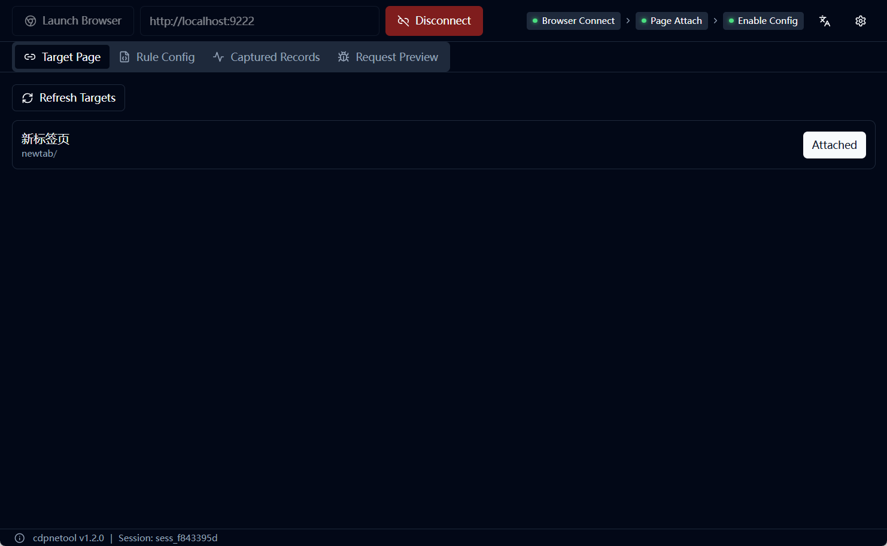
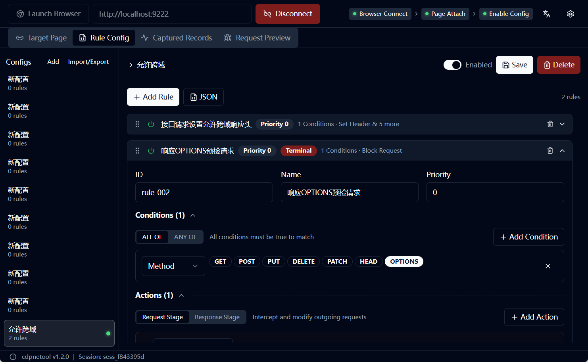
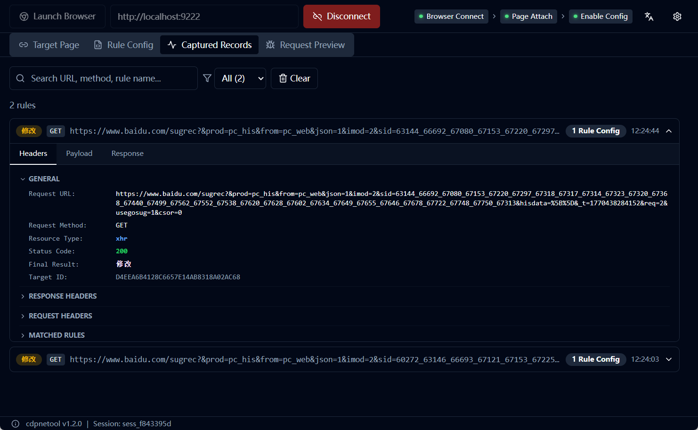
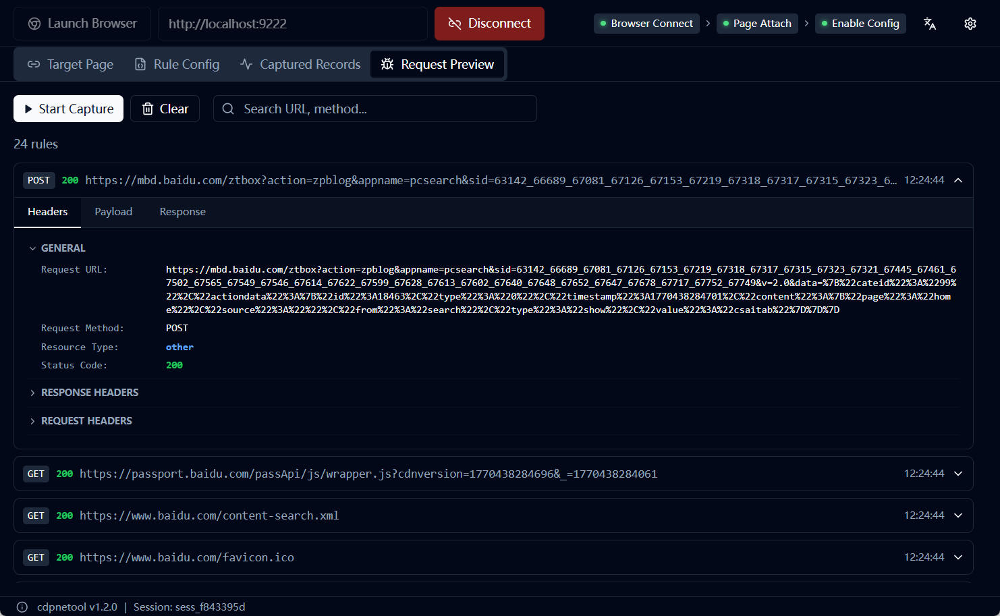

# Introduction

## What is cdpnetool

**cdpnetool** is a network request interception and modification tool based on the Chrome DevTools Protocol. It allows users to intercept and modify browser network requests in real-time through rule configuration, without writing any code.

As a cross-platform desktop application, cdpnetool provides an intuitive visual interface that makes it easy for developers, testers, and even regular users to achieve precise control and flexible modification of network requests.

---

## Core Features

- ✅ **Real-time Network Interception**  
  Intercept all HTTP/HTTPS requests and responses in the browser, supporting all resource types (XHR, Fetch, Document, Script, Image, etc.)

- ✅ **Flexible Rule Configuration**  
  Provides visual rule editor and JSON source code editing dual modes to meet different user habits

- ✅ **Rich Matching Conditions**  
  Supports multi-dimensional matching of URL, Header, Query parameters, Cookie, Body, etc., with precise matching, contains matching, regular expressions, and other matching methods

- ✅ **Powerful Modification Capabilities**  
  Can modify almost all properties of network requests including request URL, method, headers, body, response status code, headers, and body

- ✅ **Configuration Management**  
  Supports multi-configuration saving, quick switching, import/export, facilitating team collaboration and configuration sharing

- ✅ **Event Monitoring**  
  View matched and unmatched request events in real-time, providing DevTools-style detail panel for easy debugging and analysis

- ✅ **Request Preview**  
  Full traffic monitoring, view all network requests (not limited to matched requests), supports on/off capture

- ✅ **System Settings**  
  Supports language switching (Simplified Chinese/English), theme mode (light/dark/follow system), browser custom configuration

- ✅ **Built-in Browser**  
  One-click launch of independent Chrome instance, no need to manually configure startup parameters

---

## Use Cases

### Frontend Development Scenarios

- **Mock API Data**: Mock interface responses without waiting for backend development
- **Test Different Data States**: Modify interface response data to quickly test UI performance under various boundary conditions
- **Debug CORS Issues**: Modify response headers to bypass CORS restrictions for local development
- **Resource Replacement Debugging**: Replace online JS/CSS files with local versions for debugging without redeployment

### Software Testing Scenarios

- **Boundary Testing**: Modify request parameters to test boundary conditions and exception handling logic
- **Error Simulation**: Simulate various error responses (500, 404, timeout, etc.) to verify system fault tolerance
- **Security Testing**: Inject special characters and malicious data to test anti-injection and security protection capabilities
- **Performance Analysis**: Block specific resource loading to analyze their impact on page performance

### Reverse Analysis Scenarios

- **Protocol Analysis**: Intercept and analyze encrypted requests to study API protocols and communication mechanisms
- **Behavior Probing**: Modify request parameters to probe server processing logic and business rules
- **Restriction Bypass**: Bypass client validation and restrictions for in-depth application behavior analysis

### Regular User Scenarios (Through Shared Configuration)

- **Personalization**: Replace website style files, fonts, images, etc. for personalized browsing experience
- **Ad Blocking**: Block specific ad requests to purify browsing environment
- **Network Acceleration**: Block tracking scripts, statistics code, and unnecessary resources to reduce page load time
- **Feature Enhancement**: Modify API responses to extend functionality, such as removing copy restrictions, download restrictions, right-click restrictions, etc.
- **Localization**: Replace interface data for UI localization or content customization
- **Mobile Debugging**: Combined with remote debugging, modify mobile web requests and responses

### Team Collaboration Scenarios

- **Configuration Sharing**: Share test configuration files with team members for unified test environment and data
- **Problem Reproduction**: Import others' configuration files to quickly reproduce and locate issues
- **Standardization**: Establish unified Mock data specifications and testing standards for the team

---

## Technical Architecture

### Tech Stack

- **Frontend**: React 18 + TypeScript + Vite + TailwindCSS
- **Backend**: Go + Wails v2 (native desktop framework)
- **Protocol**: Chrome DevTools Protocol (CDP)
- **Storage**: SQLite (configuration and history persistence)
- **Internationalization**: react-i18next (Chinese/English support)

### Core Features

- **CDP Protocol Based**: Direct control of browser underlying, no need to install proxy or certificates
- **Rule Engine**: Supports regular expressions and complex condition combinations for precise matching
- **Worker Pool**: Concurrent processing mechanism ensuring high performance and throughput
- **Page-level Interception**: Only intercept traffic from specified pages without affecting other system network communications

---

## Why Choose cdpnetool

### Compared to Traditional Proxy Tools (Charles/Fiddler)

- ✅ **Simple Operation**: Edit configuration rules through client interface, no need to write complex scripts
- ✅ **No HTTPS Certificate Installation**: Based on CDP protocol, no need to trust self-signed certificates
- ✅ **Page-level Interception**: More precise control granularity without affecting other applications
- ✅ **More Convenient Configuration Management**: Supports multi-configuration saving, import/export, and quick switching

### Compared to Browser Extensions

- ✅ **More Powerful**: Not limited by browser extension API, can modify more content
- ✅ **More Professional Interface**: Independent window operation providing complete event monitoring and debugging functions
- ✅ **Better Performance**: Runs in independent process without occupying browser main process resources

### Compared to Chrome DevTools

- ✅ **Visual Rule Configuration**: No need for manual operation, automatically process requests through rules
- ✅ **Rules Can Be Saved and Reused**: Configuration can be persistently saved, greatly improving work efficiency
- ✅ **Batch Processing Capability**: Supports complex matching logic to process a large number of requests at once

---

## Quick Preview

> 💡 The following images showcase cdpnetool's main interface and core features

### Figure 1: Main Interface Overview

Showcasing four core panels: Targets (Target Management), Rules (Rule Configuration), Events (Event Monitoring), Network (Request Preview)

**Targets Panel**:

**Rules Panel**:

**Events Panel**:

**Network Panel**:

---

## Getting Started

Ready to start using cdpnetool? Continue reading the [Quick Start](./02-quick-start.md) section to learn how to install and run cdpnetool.

If you want to dive deep into rule configuration details, you can jump directly to the [Rule Configuration Reference](./03-rule-reference.md) section.
